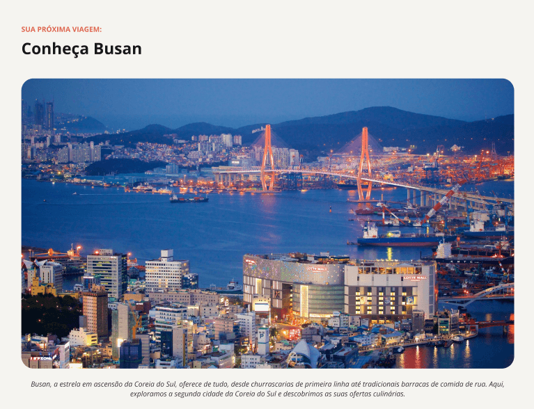

# Página Turística — Busan 🌏

<br>
*Preview do projeto — página turística sobre Busan.*

Projeto desenvolvido como parte do curso Full-Stack da Rocketseat, utilizando HTML e CSS.

## Tecnologias
- HTML5
- CSS3

## Objetivo
Praticar a estruturação de páginas com HTML e a estilização com CSS, criando uma página turística apresentando a cidade de Busan.

## Como visualizar
1. Clone o repositório:
   ```bash
   git clone https://github.com/muddyorc/local_turistico.git
