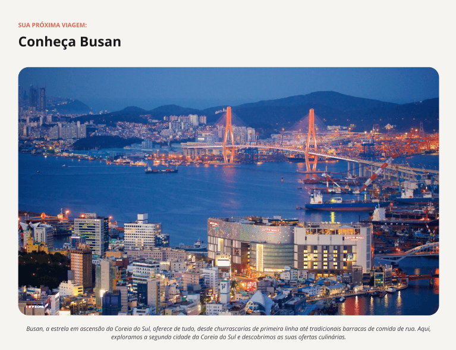

# Página Turística — Busan


*Preview da página turística sobre a cidade de Busan.*

Projeto desenvolvido como parte do curso **Full-Stack da Rocketseat**, com foco no estudo de **HTML5** e **CSS3**.


## Tecnologias Utilizadas
- **HTML5**
- **CSS3**


## Objetivo do Projeto
O objetivo deste projeto é praticar a estruturação de páginas utilizando **HTML semântico** e a estilização com **CSS**, por meio da criação de uma página turística apresentando a cidade de Busan.


## Como visualizar o projeto

### 1. Clone o repositório
```bash
git clone https://github.com/muddyorc/local_turistico.git
